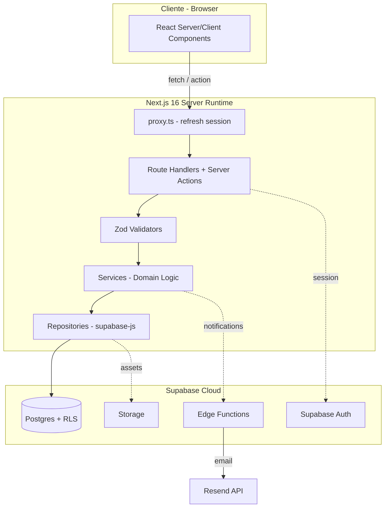

# VETPAL — Arquitectura del Sistema

> Documento arquitectónico de la plataforma digital integral de atención canina.
> Alineado con la **Entrega Previa 2** (PMI/PMBOK® 7ma. edición) del Politécnico Grancolombiano.

---

## 1. Resumen ejecutivo

**VETPAL** es una plataforma web que integra la gestión end-to-end de servicios veterinarios caninos en cinco verticales: **salud preventiva, estética, nutrición, guardería/hotel y servicios funerarios**. Conecta a los **propietarios de caninos** con **veterinarios y administradores** a través de flujos digitales de catálogo, agendamiento, historia clínica y pagos, todo soportado por un backend único sobre Supabase (PostgreSQL gestionado + Auth + Edge Functions).

Objetivos de producto clave (derivados del Plan de Calidad §1.2):

- Lighthouse Performance ≥ 90/100.
- Latencia API P95 < 300 ms.
- Cobertura de pruebas ≥ 80 % en servicios críticos.
- Accesibilidad WCAG 2.1 AA en todas las vistas principales.

---

## 2. Módulos principales

### 2.1 Auth — Autenticación y autorización

- **Proveedor:** Supabase Auth (JWT + cookies `httpOnly` seguras).
- **Casos de uso:** registro de propietarios, login, recuperación de contraseña, logout.
- **Autorización:** Row Level Security (RLS) por tabla en PostgreSQL. Roles: `propietario`, `veterinario`, `administrador` (ENUM `rol_usuario`).
- **Sesión:** renovación transparente vía `proxy.ts` (Next.js 16) usando `@supabase/ssr`.

### 2.2 Agendamiento de Citas

- **Casos de uso:** búsqueda de disponibilidad, creación/modificación/cancelación de citas por el propietario; confirmación, reagendamiento y cierre por el veterinario.
- **Notificaciones:** Supabase Edge Functions + Resend para emails transaccionales (confirmación, recordatorio, cancelación).
- **Estados:** `pendiente → confirmada → completada | cancelada`.

### 2.3 Historial Clínico

- **Casos de uso:** el veterinario registra motivo de consulta, diagnóstico, tratamiento y medicamentos; el propietario consulta el historial completo de su canino.
- **Relación:** 1 cita completada → 1 registro clínico (FK `UNIQUE` sobre `cita_id`).
- **Acceso:** RLS garantiza que solo el propietario del canino o el veterinario tratante pueden leer el registro.

### 2.4 Catálogo de Servicios

- **Casos de uso:** el `administrador` gestiona el CRUD del catálogo; el `propietario` explora y lanza un agendamiento desde un servicio seleccionado.
- **Categorías:** `salud_preventiva`, `estetica`, `nutricion`, `guarderia`, `funerarios`.
- **Estados:** `activo = true | false` para retiros sin borrar historial.

---

## 3. Flujos de usuario

### 3.1 Propietario

```
Registro → Login → Registrar canino → Explorar catálogo →
Elegir servicio y horario → Confirmar cita → Pagar →
(tras consulta) Consultar historial clínico
```

### 3.2 Veterinario / Administrador

```
Login → Ver agenda del día → Confirmar/Reagendar citas →
Atender consulta → Registrar historial clínico →
(admin) Gestionar catálogo de servicios
```

---

## 4. Stack técnico definitivo

| Capa            | Tecnología                                                | Versión       |
| --------------- | --------------------------------------------------------- | ------------- |
| Framework       | Next.js (App Router + Turbopack)                          | `16.2.4`      |
| Runtime UI      | React                                                     | `19.2.4`      |
| Lenguaje        | TypeScript                                                | `^5`          |
| Estilos         | Tailwind CSS                                              | `v4`          |
| Design System   | shadcn (`style: radix-luma`, `baseColor: neutral`)        | `^4.4.0`      |
| Iconografía     | lucide-react                                              | `^1.9.0`      |
| Primitivas      | radix-ui                                                  | `^1.4.3`      |
| BaaS / DB       | Supabase (Postgres, Auth, Edge Functions, Storage)        | —             |
| Cliente BD      | `@supabase/supabase-js`                                   | `^2.104.1`    |
| SSR Cookies     | `@supabase/ssr` (pendiente de instalar)                   | `^0.x`        |
| CLI Supabase    | `supabase`                                                | `2.90.0`      |
| Validación      | Zod (pendiente de instalar)                               | `^3.x`        |
| Proxy Edge      | `proxy.ts` (Next.js 16 — reemplaza `middleware.ts`)       | nativo        |
| Testing unit    | Jest + React Testing Library (pendiente)                  | —             |
| Testing E2E     | Playwright (pendiente)                                    | —             |
| CI/CD           | GitHub Actions → Vercel                                   | —             |

**Proyecto Supabase:** `vetpal` (ref `rwxtqixsgfdaozbeivsy`, región West US Oregon). Variables ya cargadas en [`.env.local`](.env.local).

---

## 5. Decisiones arquitectónicas (ADRs compactos)

### ADR-001 · Supabase sobre Clerk

**Decisión:** usar Supabase Auth como único proveedor de identidad y autorización.
**Justificación:** Supabase ya provee Postgres, Storage, Edge Functions y RLS nativo. Introducir Clerk duplicaría el modelo de usuario, requeriría sincronización manual con la BD y complicaría el RLS (JWT externo vs `auth.uid()` nativo). Con Supabase Auth, las políticas RLS se escriben directamente con `auth.uid()` sin webhooks ni adaptadores. Adicionalmente, la Entrega 1 consolidó Supabase como única fuente backend.

### ADR-002 · Patrón 3 capas Controller → Service → Repository

**Decisión:** organizar la lógica en tres capas independientes (PDF §3).

- **Controllers** → Route Handlers de Next.js (`src/app/api/**/route.ts`) y Server Actions. Validan con Zod y delegan.
- **Services** → Lógica de dominio pura, sin dependencias HTTP ni supabase-js directo.
- **Repositories** → Acceso a datos con `supabase-js` tipado desde `database.types.ts`.

**Beneficios:** testeabilidad (mock del repo en unit tests), separación SoC, reemplazo del ORM sin tocar servicios.

### ADR-003 · Migración a `src/app`

**Decisión:** mover `app/`, `components/`, `lib/` bajo `src/`.
**Justificación:** encapsula el dominio, reduce colisiones con config de raíz, facilita rutas de alias (`@/*` → `./src/*`) y es la convención recomendada por Next.js cuando el proyecto crece en dominios (skill `next-best-practices`).

### ADR-004 · `proxy.ts` en lugar de `middleware.ts`

**Decisión:** usar `src/proxy.ts` para el refresco de sesión de Supabase.
**Justificación:** en **Next.js 16**, el archivo `middleware.ts` está **deprecado** y fue renombrado a `proxy.ts` (ver `node_modules/next/dist/docs/01-app/03-api-reference/03-file-conventions/proxy.md`). Mantener el nombre antiguo provoca warnings y rompe las optimizaciones CDN del nuevo Proxy.

### ADR-005 · Tailwind v4 + shadcn `radix-luma`

**Decisión:** mantener la configuración ya establecida en [`components.json`](components.json): `style: radix-luma`, `baseColor: neutral`, `cssVariables: true`.
**Justificación:** el estilo `radix-luma` ofrece una estética moderna y coherente con la paleta propuesta en [`design-tokens.md`](design-tokens.md); evitamos reinstalar componentes al cambiarlo.

### ADR-006 · Validación con Zod en la capa Controller

**Decisión:** todos los Route Handlers y Server Actions validan sus inputs con un `z.object(...)` antes de llegar al Service.
**Justificación:** frontera única de validación, errores consistentes (`safeParse`), tipos inferidos (`z.infer`) reutilizables en el Service, evita validaciones duplicadas.

### ADR-007 · Tipos generados con `supabase gen types`

**Decisión:** ejecutar `supabase gen types typescript --linked > src/lib/supabase/database.types.ts` tras cada migración.
**Justificación:** elimina el drift entre BD y TS, detecta rupturas en CI, es recomendado por la skill `supabase` y por el rol de QA (PDF §8.4).

### ADR-008 · Server Components por defecto

**Decisión:** cada página y layout es Server Component salvo que requiera interactividad/estado. Los componentes con `"use client"` se aíslan en `src/components/` y reciben datos ya resueltos.
**Justificación:** reduce bundle del cliente, permite fetch en paralelo con `Promise.all`, mejora Core Web Vitals (objetivo Lighthouse ≥ 90).

### ADR-009 · RLS habilitado desde el día 1

**Decisión:** toda tabla del esquema `public` nace con `ENABLE ROW LEVEL SECURITY` en la migración `001_initial_schema.sql`. Cada tabla tiene al menos una política.
**Justificación:** principio #4 de la skill `supabase` — las tablas del esquema `public` son accesibles vía Data API; una tabla sin RLS es una fuga de datos pública. Además, el PDF exige cero violaciones RLS en la suite de pruebas (§8.2).

### ADR-010 · Autorización con `raw_app_meta_data` (no `user_metadata`)

**Decisión:** cuando necesitemos propagar el rol al JWT para políticas RLS, escribimos `role` en `raw_app_meta_data` (server-side, mediante función `SECURITY DEFINER`), **nunca** en `raw_user_meta_data`.
**Justificación:** `raw_user_meta_data` es editable por el cliente y usarlo en decisiones de autorización abre un bypass trivial (skill `supabase`, sección Security Checklist).

---

## 6. Estructura de carpetas propuesta (`src/`)

```
src/
  app/
    (auth)/
      login/page.tsx
      register/page.tsx
      forgot-password/page.tsx
    (dashboard)/
      layout.tsx
      caninos/
        page.tsx
        [id]/page.tsx
      citas/
        page.tsx
        nueva/page.tsx
      historial/
        [caninoId]/page.tsx
      catalogo/
        page.tsx
    api/                       # Route Handlers — capa Controller
      citas/route.ts
      historial/route.ts
      catalogo/route.ts
    layout.tsx                 # root layout (fuentes, theme, Toaster)
    page.tsx                   # landing pública
  components/
    ui/                        # shadcn (button, input, dialog, ...)
    forms/                     # formularios de dominio
    shared/                    # header, sidebar, empty-state, etc.
  lib/
    supabase/
      server.ts                # createClient para RSC / Route Handlers
      client.ts                # createBrowserClient
      service.ts               # cliente con service_role (solo server)
      database.types.ts        # generado por `supabase gen types`
    services/                  # capa Service — lógica de negocio pura
      citas.service.ts
      historial.service.ts
      catalogo.service.ts
      pagos.service.ts
    repositories/              # capa Repository — acceso a datos
      usuarios.repository.ts
      caninos.repository.ts
      citas.repository.ts
      historial.repository.ts
      pagos.repository.ts
    validators/                # schemas Zod
      cita.schema.ts
      historial.schema.ts
    utils.ts
  hooks/
    use-user.ts
    use-toast.ts
  proxy.ts                     # Next.js 16 — refresco de sesión Supabase
supabase/
  migrations/
    001_initial_schema.sql
  config.toml
```

> **Migración desde la estructura actual:** hoy los directorios `app/`, `components/` y `lib/` viven en la raíz. La migración implica moverlos bajo `src/` y actualizar `tsconfig.json` (`"paths": { "@/*": ["./src/*"] }`). **No se realizará en esta tarea** — solo se documenta.

---

## 7. Diagrama de módulos (3 capas)



---

## 8. Convenciones de calidad mínimas

- **Linting:** ESLint + Biome (PDF §1.3).
- **Formato:** Biome (una sola fuente de verdad).
- **Tipos:** `strict: true` en [`tsconfig.json`](tsconfig.json); prohibido `any` sin justificación escrita.
- **Commits:** convención Conventional Commits.
- **PRs:** mínimo 1 aprobador (PDF §1.5 paso 3), CI verde obligatorio.
- **Accesibilidad:** todo componente nuevo pasa `axe-core` antes de merge.

---

## 9. Lo que NO está en alcance de este documento

- Implementación de componentes UI.
- Configuración de `next.config.ts`.
- Instalación de dependencias nuevas (Zod, `@supabase/ssr`, Jest, Playwright).
- Ejecución de migraciones o `supabase link`.
- Estructura de testing y pipeline CI/CD (irán en documentos posteriores).

---


